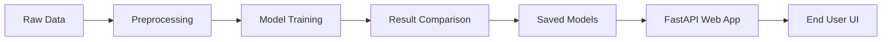

# House Price Prediction Project: Aura Estates

This project provides an end-to-end Machine Learning pipeline for predicting house prices using the Ames Housing dataset. It includes data preprocessing, model selection, training, evaluation, and a FastAPI-based web application for real-time predictions.

## Project Architecture

The pipeline follows a structured flow from raw data to a deployed model:



---

## 1. How the Data Looks

The raw data is stored in `data/raw/` and consists of several CSV files:

- **`train.csv`**: Contains feature columns and the target variable `SalePrice`.
- **`test.csv`**: Identical feature columns, used for generating final predictions.
- **`data_description.txt`**: A detailed data dictionary explaining each of the 79 features (e.g., `LotArea`, `YearBuilt`, `OverallQual`).

### Key Features Used in Web App:
For the real-time prediction interface, we focus on high-impact features:
- **`GrLivArea`**: Above grade living area square feet.
- **`OverallQual`**: Material and finish quality (1-10 scale).
- **`TotalBsmtSF`**: Total basement area.
- **`FullBath`**: Number of full bathrooms.
- **`GarageCars`**: Car capacity of the garage.
- **`YearBuilt`**: Original construction date.

---

## 2. Preprocessing (`preprocessing.py`)

Raw data requires cleaning before training. Our pipeline handles this automatically:

- **Missing Value Imputation**:
  - Numerical features are filled with their **mean**.
  - Categorical features are filled with the constant `'none'` (since "NA" often implies the absence of a feature like a pool or fence).
- **Feature Scaling**: All numerical values are transformed to a `[0, 1]` range using `MinMaxScaler` to ensure models (like SVM or Linear Regression) aren't biased by large numbers.
- **Encoding**: Categorical features are converted into numerical format using **One-Hot Encoding**, resulting in **286 features** for our model.
- **ID & Sparse Feature Removal**: We drop `Id` and columns with >50% nulls (`Alley`, `PoolQC`, etc.).

---

## 3. Training and Evaluation (`models.py` & `cli.py`)

We take a rigorous approach to finding the best model by comparing multiple regression algorithms.

### Model Comparison
The `cli.py` script automatically evaluates several base models using **Root Mean Squared Error (RMSE)**:

| Model | Status | Performance (RMSE) |
| :--- | :--- | :--- |
| **XGBoost** | **Winner** | **~26,164** |
| RandomForest | Top Contender | ~27,032 |
| Linear Regression | Baseline | ~28,136 |
| Ridge / SVR | Other | ~28,500+ |

### Optimization
The project uses **Optuna** (`tune_xgboost` function) to fine-tune the hyperparameters of the XGBoost model, adjusting parameters like `learning_rate`, `max_depth`, and `n_estimators` to achieve the lowest possible error.

---

## 4. Saving Artifacts

Once the best model (XGBoost) is trained, it and the fitted preprocessors are saved to the `models/` directory:
- `xgboost_model.joblib`: The trained predictor.
- `transformers.joblib`: The scaling and encoding settings needed to process future user input.

---

## 5. Showing to the FE (Web App)

The final step is serving the prediction capability via a **FastAPI** web application.

- **Backend**: `webapp/main.py` defines a `/predict` endpoint.
- **Data Validation**: A Pydantic schema (`HouseFeatures`) ensures that user inputs from the frontend are valid (e.g., `YearBuilt` must be between 1800 and 2026).
- **Inference Pipeline**:
  1. User submits house features via a web form.
  2. The app loads the saved `transformers`.
  3. Raw inputs are scaled and encoded exactly like the training data.
  4. The `xgboost_model` predicts the price.
  5. The result is returned as a JSON object: `{"prediction": 185000.0}`.

### How to Run Locally

1. **Train the model**:
   ```bash
   python3 src/house_price_prediction/cli.py
   ```
2. **Start the Web App**:
   ```bash
   uv run serve-app
   ```
   The app will be available at `http://localhost:8000`.
